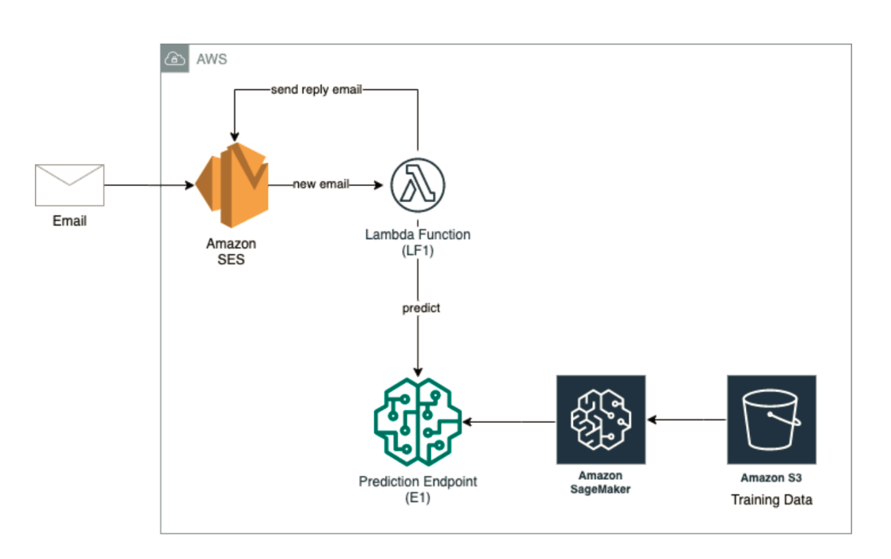
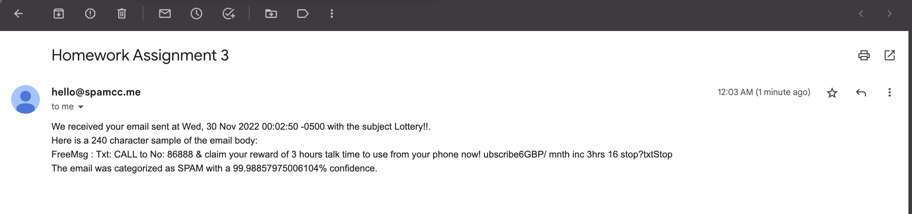

# AWS Spam email detection
Implementation of a machine learning model to predict whether a message is spam or not and create a system that upon receipt of an email message will automatically flag it as spam or not, based on the prediction obtained from the machine learning model

### Team Members
#### 1. Srividhya Ravichandran
#### 2. Roshni Sen

